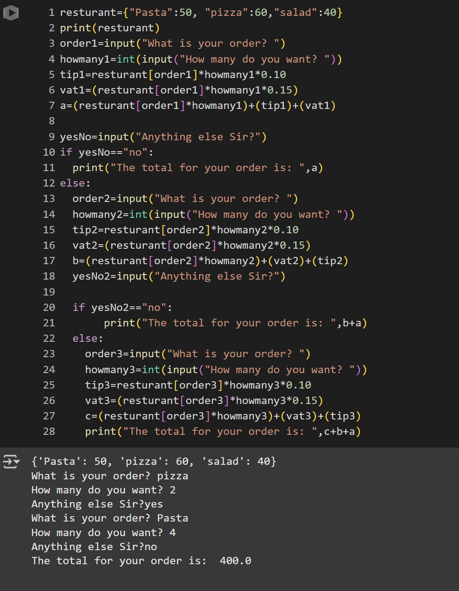

# Restaurant Bill Generator 

This Python program simulates creating a restaurant bill.  
It includes a menu list with item names, quantities, prices, total calculation, VAT, and tip. The final bill is neatly printed and includes all relevant charges.

---

## Requirements Covered
- Add items with their prices
- Input quantity for each item
- Calculate subtotal
- Add 15% Value-Added Tax (VAT)
- Add 10% tip
- Print the final bill in a clean, formatted layout

---

## Technologies Used
- Python

---

